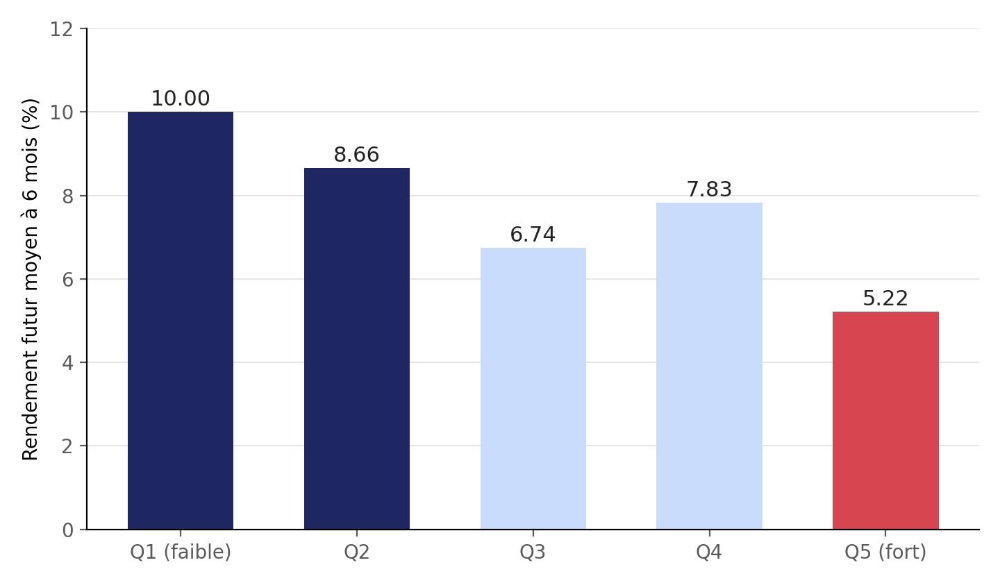

# **Momentum et rendements boursiers futurs**

Étude exploratoire de *factor investing* : le rendement passé d'une action (son momentum) permet-il de prédire son rendement futur ? Projet personnel de Machine Learning appliqué à la finance quantitative.

## Sommaire

1\) Contexte et motivations  
2\) Problématique  
3\) Données et méthodologie  
4\) Résultats  
5\) Renforcement méthodologique  
6\) Comparaison à un second facteur  
7\) Limites méthodologiques  
8\) Ce que ce projet m'a appris  
9\) Conclusion  
10\) Structure du dépôt  
11\) Reproduire l'analyse

## 1\) Contexte et motivations

Ce projet est né d'une démarche d'auto-formation au Machine Learning appliqué à la finance, menée en parallèle d'un parcours de spécialités Mathématiques et Physique-Chimie en Terminale, avec une orientation envisagée vers les métiers de la finance de marché. Plutôt que de suivre un cours théorique complet avant de se lancer, l'apprentissage a été mené directement au fil d'un projet concret : chaque notion (Python, statistiques, algèbre linéaire, Machine Learning) a été introduite au moment précis où le projet en avait besoin.

Le choix du *factor investing* comme thème, et du momentum comme facteur d'entrée, répond à un double objectif : explorer un sujet à l'intersection des mathématiques, de la programmation et de la finance de marché, tout en produisant un travail suffisamment rigoureux.

## 2)Problématique

Le *factor investing* cherche à identifier des caractéristiques mesurables (des « facteurs ») capables d'expliquer, au moins en partie, les rendements futurs des actions. Le facteur étudié ici est le **momentum** : l'idée qu'une action ayant bien performé récemment aurait tendance à continuer sur sa lancée, et inversement pour une action ayant mal performé.

**Problématique**: le rendement d'une action sur les 6 derniers mois permet-il de prédire, même partiellement, son rendement sur les 6 mois suivants ?

L'objectif n'est pas de construire une stratégie de trading opérationnelle, mais de mener une démarche de data science rigoureuse, de la collecte des données jusqu'à l'évaluation honnête d'un modèle, en évitant les biais méthodologiques classiques de la finance quantitative (*data leakage*, *look-ahead bias*, non-indépendance des observations).

## 3)Données et méthodologie

- **Univers** : 20 actions du CAC 40 (secteurs variés : luxe, énergie, banque, santé, industrie, technologie, biens de consommation)  
- **Période** : 2019-01-01 à 2024-01-01, prix de clôture quotidiens (`yfinance`), 1283 jours de cotation, 0 valeur manquante  
- **Variables construites** :  
  - `momentum_6m` : rendement sur les 126 derniers jours de cotation (`pct_change(periods=126)`)  
  - `future_return_6m` : rendement sur les 126 jours suivants (`shift(-126)`)  
- **Nettoyage** : les observations sans momentum passé (début de période) ou sans rendement futur (fin de période) sont **supprimées**, jamais estimées — les remplacer injecterait une information non disponible à la date considérée (*look-ahead bias*)  
- **Découpage entraînement / test** : chronologique (entraînement avant juillet 2022, test après), pas aléatoire, pour ne jamais mélanger passé et futur

## 4)Résultats

### Premier signal (panier initial de 6 actions)

| Tertile de momentum | Rendement futur moyen à 6 mois |
| :---- | :---- |
| Faible | 9,46 % |
| Moyen | 8,62 % |
| Fort | 5,18 % |

Corrélation momentum / rendement futur : **\-0,18** → effet de **retour à la moyenne**, plutôt qu'un momentum classique.

Un test t entre tertiles extrêmes donne une p-value ≈ 3×10⁻¹⁶, mais cette valeur est probablement optimiste : les observations ne sont pas indépendantes (voir limites(7)).

## 5)Renforcement méthodologique : élargissement du panier d'actions

L'analyse a été reproduite sur un panier élargi de **20 actions** afin de tester la robustesse du signal.

| Quintile de momentum | Rendement futur moyen à 6 mois |
| :---- | :---- |
| Q1 (faible) | 10,00 % |
| Q2 | 8,66 % |
| Q3 | 6,74 % |
| Q4 | 7,83 % |
| Q5 (fort) | 5,22 % |

Corrélation sur le panier élargi : **\-0,053** (contre \-0,18 sur 6 actions). Le signal s'atténue nettement mais ne disparaît pas ni ne change de signe, signe d'un effet plus modeste mais plus crédible qu'un artefact de petit échantillon.

## 6)Modélisation et évaluation

rendement futur prédit \= 7,53 − 0,093 × momentum\_6m

| Métrique (test set, 6 actions) | Valeur |
| :---- | :---- |
| R² | 0,019 |
| MAE du modèle | 10,28 |
| MAE baseline naïve (moyenne) | 10,95 |

Le R² faible n'est pas un échec : les rendements financiers sont dominés par du bruit imprévisible, et un R² élevé serait même suspect de *data leakage*. Le modèle réduit néanmoins l'erreur d'environ 6 % par rapport à une prédiction naïve, un signal réel, quoique modeste.

Sur le panier élargi à 20 actions, le signal devient à la limite du détectable (R² \= \-0,028, MAE quasiment égale à la baseline), illustrant que l'effet observé sur 6 actions était en partie gonflé par la taille réduite de l'échantillon.

## 7)Comparaison à un second facteur : la volatilité

Un second facteur classique du *factor investing*, la volatilité annualisée à 6 mois, a été testé selon la même méthodologie, pour évaluer si l'anomalie de « faible volatilité » documentée dans la littérature académique se retrouve sur cet échantillon.

| Quintile de volatilité | Rendement futur moyen à 6 mois |
| :---- | :---- |
| Q1 (faible vol.) | 10,38 % |
| Q2 | 5,45 % |
| Q3 | 6,06 % |
| Q4 | 9,14 % |
| Q5 (forte vol.) | 7,43 % |

Corrélation : **\+0,069** (signe opposé à l'anomalie attendue), et aucune tendance régulière entre quintiles contrairement au momentum. Ce résultat ne signifie pas que l'anomalie de faible volatilité n'existe pas (elle est documentée sur des échantillons bien plus larges et des périodes bien plus longues), seulement qu'elle ne se manifeste pas clairement à cette échelle.

## 8)Limites méthodologiques

- **Non-indépendance des observations** : un même choc de marché (ex. Covid-19) est compté plusieurs fois à travers les actions, et les fenêtres de 6 mois se chevauchent dans le temps la p-value du test t est probablement optimiste.  
- **Facteurs étudiés séparément** : momentum et volatilité n'ont pas été combinés dans un modèle multivarié testant leur apport conjoint.  
- **Échantillon limité dans le temps** : 5 ans de données, insuffisant pour trancher définitivement sur des effets qui se manifestent parfois sur plusieurs décennies.  
- **Coûts de transaction ignorés** : une stratégie réelle fondée sur ce signal serait moins rentable en pratique qu'en théorie.

## 9)Ce que ce projet m'a appris

Sur le plan technique, ce projet a nécessité de prendre en main Python et l'écosystème de la data science (Pandas, NumPy, scikit-learn, SciPy) en partant de zéro, en construisant une intuition progressive des structures de données avant de les appliquer à des données financières réelles.

Sur le plan méthodologique, l'enseignement le plus important a été de comprendre qu'un résultat impressionnant sur un petit échantillon peut être artificiellement gonflé, et qu'il doit systématiquement être mis à l'épreuve : par l'élargissement de l'échantillon, par la comparaison à une baseline naïve, et par la vérification des hypothèses statistiques sous-jacentes. Le passage d'une corrélation de \-0,18 (6 actions) à \-0,053 (20 actions) illustre concrètement ce qu'est un effet de sur-apprentissage sur un petit échantillon.

Enfin, ce projet a appris à présenter un résultat scientifique avec honnêteté : savoir dire qu'un modèle a un faible pouvoir explicatif sans que cela invalide le travail, et savoir documenter les limites d'une étude plutôt que de les dissimuler pour rendre les résultats plus séduisants qu'ils ne le sont réellement.

## Conclusion et prochaines étapes

Cette étude met en évidence un signal de retour à la moyenne à 6 mois, faible mais réel, confirmé à travers cinq méthodes d'analyse différentes (corrélation, tri par groupes, régression, comparaison à une baseline, comparaison à un second facteur) et sur deux échelles d'échantillon  en assumant honnêtement ses limites plutôt qu'en les dissimulant.

Prochaines étapes envisagées :

- [ ] Combiner momentum et volatilité dans un modèle multivarié  
- [ ] Tester la robustesse sur une période plus longue ou un panier encore plus large

## Structure du dépôt

.

├── README.md

├── notebooks/notebook.ipynb              \# Notebook complet (Google Colab)

├── rapport-projet-momentum.docx  \# Rapport détaillé (méthodologie, résultats, annexe de code)

├── docs/presentation-projet-momentum.pptx  \# Diaporama de synthèse

├── assets/

│   └── quintiles\_chart.png

└── requirements.txt

## Reproduire l'analyse

pip install -r requirements.txt

Le notebook peut être exécuté directement dans [Google Colab](https://colab.research.google.com/) sans installation locale. Les données sont téléchargées automatiquement via `yfinance` au début du notebook  aucun fichier de données n'a besoin d'être fourni séparément.

## Licence

Projet personnel à but pédagogique  libre de réutilisation avec attribution.  
